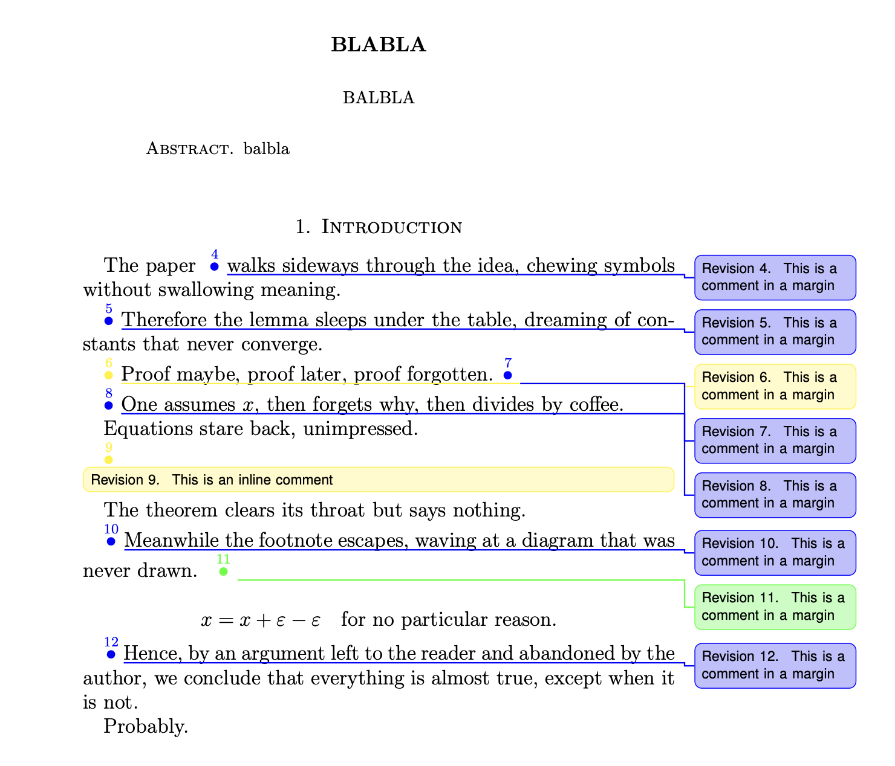
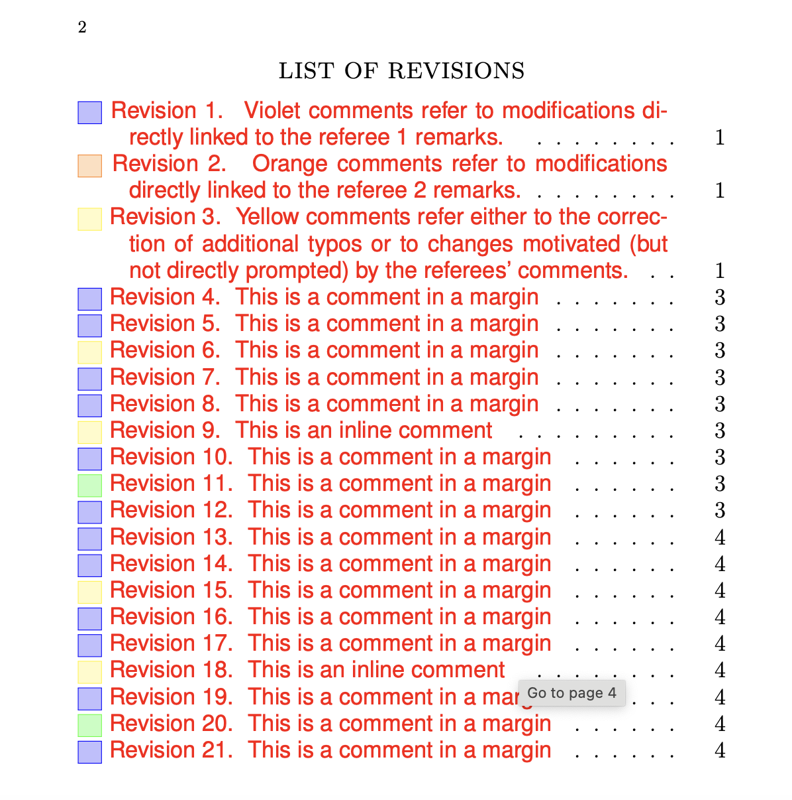
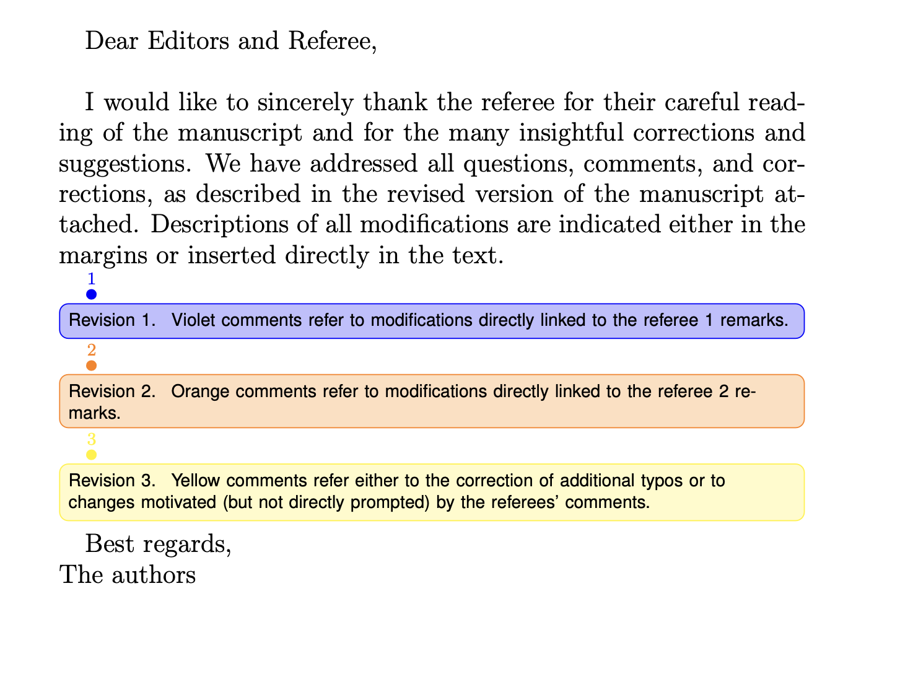
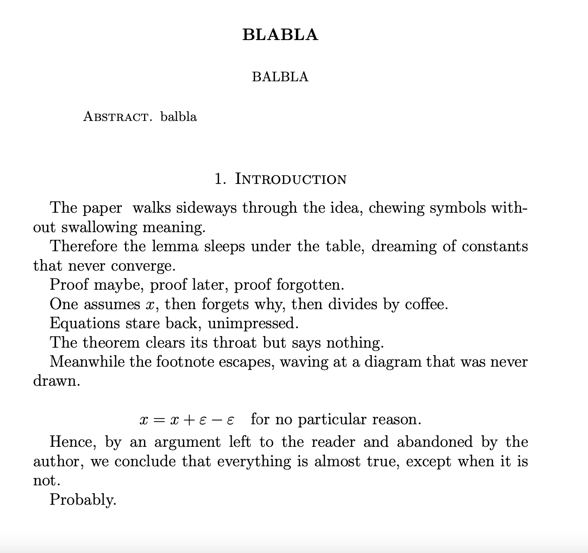

# Revision

A LaTeX template for managing paper revisions with margin and inline notes using `todonotes` and `etoolbox`.

## Features

- **Global switch**: Toggle between revision mode (with notes) and final mode (clean version)
- **Margin notes**: Add numbered revision comments in the margin with `\change`
- **Inline notes**: Add numbered revision comments inline with `\changei`
- **Color coding**: Support for multiple colors to distinguish referee comments
- **Automatic numbering**: All revisions are numbered sequentially
- **List of revisions**: Automatically generated summary of all changes

## Usage

### Basic Setup

Set the global switch in your preamble:

```latex
\newbool{norevisionnotes}
\setbool{norevisionnotes}{false}  % true for final version, false for revision
```

### Commands

**Margin notes:**
```latex
\change{Your comment here}
\change[color]{Your comment here}
```

**Inline notes:**
```latex
\changei{Your comment here}
\changei[color]{Your comment here}
```

### Color Coding Example

Use different colors to distinguish between referees:

```latex
\changei{Violet comments refer to referee 1 remarks.}
\changei[orange]{Orange comments refer to referee 2 remarks.}
\changei[yellow]{Yellow comments refer to additional corrections.}
```

### List of Revisions

Generate a summary of all revision notes:

```latex
\listoftodos[LIST OF REVISIONS]
```

## Requirements

- `todonotes` package (with `colorinlistoftodos` option)
- `etoolbox` package
- `hyperref` package (optional, for clickable links)

## Example Output

When `norevisionnotes=false`, the document includes:
- Cover letter/response to referees
- Numbered revision markers (①, ②, etc.) in the text
- Color-coded margin or inline comments
- Complete list of all revisions


When `norevisionnotes=true`, all revision notes are hidden and the document compiles as a clean final version.

## Examples

**Revision mode (`norevisionnotes=false`):**

  

**Final mode (`norevisionnotes=true`):**
All revision notes and markers are automatically removed from the compiled document.




